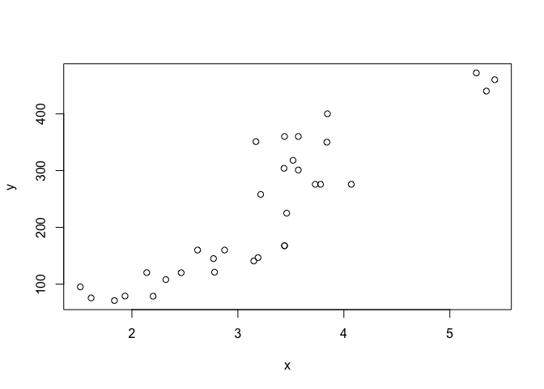
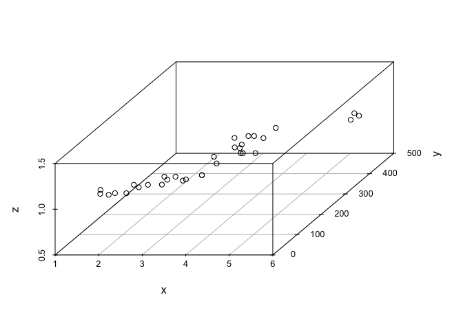
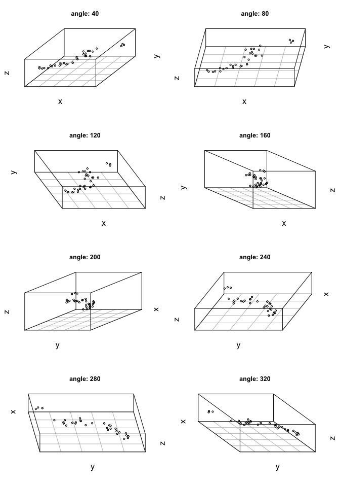

Sample 3D datasets
================

Plot `mtcars` data in 3D
------------------------

Reference: R in Action, p.264

The `mtcars` dataset comes with base R. I used it since it's what they use in the textbook example.

I assigned weight and displacement to `x` and `y`, respectively. I left `z` equal to 1 for all observations to keep the visualization simple for testing purposes.

We don't actually need to assign the variables to `x, y, z` order to generate the plots. But I figured it's helpful to remove information we don't need since we don't actually care about the `mtcars` dataset.

``` r
x <- mtcars$wt
y <- mtcars$disp
z <- rep(1,nrow(mtcars))
```

Here is a 2D scatter of `x` and `y`.

``` r
plot(x,y)
```



Here is 3D scatter with default settings from the `scatterplot3d` package.

``` r
library(scatterplot3d)
scatterplot3d(x,y,z)
```



Here is the same graph rotated 8 times by 40 degrees, the first is a duplicate of the graph above.

``` r
# generate plot
this_angle=40
par(mfrow=c(4,2))
for(i in 1:8){
  title <- paste0("angle: ",this_angle*i)
  scatterplot3d(x,y,z,
                angle=this_angle*i,
                tick.marks=F,
                main=title)
}
```



Saved the dataset to the `datasets` folder.

``` r
data_out <- data.frame(x,y,z)
write.csv(data_out, "datasets/cars.csv")
```
